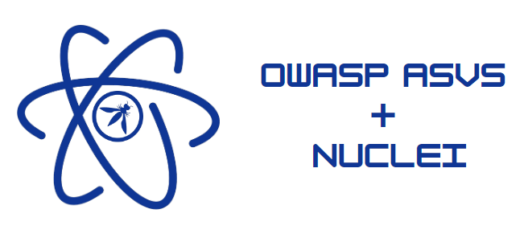

# OWASP ASVS Security Evaluation Templates with Nuclei

This project aims to develop  [Nuclei](https://github.com/projectdiscovery/nuclei) templates for evaluating OWASP Application Security Verification Standard ([ASVS](https://owasp.org/www-project-application-security-verification-standard/)) on websites and will involve creating templates that can be used to evaluate ASVS on websites, documenting the use of the templates, and designing and implementing a user interface for easy navigation and use of the templates. 
 
 The goal is to provide security professionals with an easy-to-use set of tools to test their web applications and identify potential vulnerabilities.
#### It's important to note that:
- Since the implementation methods and frameworks used in web application design are very diverse, in this project we will consider the existing best practice designs and develop nuclei templates based on them :)
- Also while these Nuclei templates are designed to help automate the process of evaluating web applications against ASVS requirements, they should not be considered a substitute for manual testing or other security best practices.
- Some templates are developed for a limited or specific scenario and should be modified and perfected according to the needs of the evaluator/user.

## Licensing

This program is free software: You can redistribute it and/or modify it under the terms of the MIT License.

## Contributing

Contributions to this repository are welcome and encouraged. If you have created new Nuclei templates that evaluate additional ASVS requirements or have any idea about current templates, we'd love to hear from you in project Github [Discussions](https://github.com/OWASP/www-project-asvs-security-evaluation-templates-with-nuclei/discussions) or our [Slack channel](https://owasp.slack.com/archives/C052939BZ43). 

For detailed information and guidelines about contributing in developing template for ASVS evaluation, please check [CONTRIBUTING.md](https://github.com/OWASP/www-project-asvs-security-evaluation-templates-with-nuclei/blob/main/CONTRIBUTING.md)

#### Core Team
The project current core team are:
- [Hamed Salimian](https://github.com/Snbig)  (Project Leader)
- [AmirHossein Raeisi](https://github.com/Ahsraeisi)  (Project Co-lead)
<h2 align="center">Available Templates</h2>
<table border="1" cellpadding="5" cellspacing="0" align="center">
        <tr><td><a href="https://github.com/OWASP/www-project-asvs-security-evaluation-templates-with-nuclei/blob/dev/templates/3.1.1.yaml">3.1.1</a></td><td><a href="https://github.com/OWASP/www-project-asvs-security-evaluation-templates-with-nuclei/blob/dev/templates/14.4.4.yaml">14.4.4</a></td><td><a href="https://github.com/OWASP/www-project-asvs-security-evaluation-templates-with-nuclei/blob/dev/templates/14.5.1.yaml">14.5.1</a></td><td><a href="https://github.com/OWASP/www-project-asvs-security-evaluation-templates-with-nuclei/blob/dev/templates/5.1.5.yaml">5.1.5</a></td><td><a href="https://github.com/OWASP/www-project-asvs-security-evaluation-templates-with-nuclei/blob/dev/templates/13.3.1.yaml">13.3.1</a></td></tr>
<tr><td><a href="https://github.com/OWASP/www-project-asvs-security-evaluation-templates-with-nuclei/blob/dev/templates/3.4.1.yaml">3.4.1</a></td><td><a href="https://github.com/OWASP/www-project-asvs-security-evaluation-templates-with-nuclei/blob/dev/templates/13.2.1.yaml">13.2.1</a></td><td><a href="https://github.com/OWASP/www-project-asvs-security-evaluation-templates-with-nuclei/blob/dev/templates/13.2.3.yaml">13.2.3</a></td><td><a href="https://github.com/OWASP/www-project-asvs-security-evaluation-templates-with-nuclei/blob/dev/templates/9.1.3.yaml">9.1.3</a></td><td><a href="https://github.com/OWASP/www-project-asvs-security-evaluation-templates-with-nuclei/blob/dev/templates/14.4.3.yaml">14.4.3</a></td></tr>
<tr><td><a href="https://github.com/OWASP/www-project-asvs-security-evaluation-templates-with-nuclei/blob/dev/templates/14.5.3.yaml">14.5.3</a></td><td><a href="https://github.com/OWASP/www-project-asvs-security-evaluation-templates-with-nuclei/blob/dev/templates/13.2.2.yaml">13.2.2</a></td><td><a href="https://github.com/OWASP/www-project-asvs-security-evaluation-templates-with-nuclei/blob/dev/templates/14.4.5.yaml">14.4.5</a></td><td><a href="https://github.com/OWASP/www-project-asvs-security-evaluation-templates-with-nuclei/blob/dev/templates/14.4.7.yaml">14.4.7</a></td><td><a href="https://github.com/OWASP/www-project-asvs-security-evaluation-templates-with-nuclei/blob/dev/templates/12.6.1.yaml">12.6.1</a></td></tr>
<tr><td><a href="https://github.com/OWASP/www-project-asvs-security-evaluation-templates-with-nuclei/blob/dev/templates/12.1.1.yaml">12.1.1</a></td><td><a href="https://github.com/OWASP/www-project-asvs-security-evaluation-templates-with-nuclei/blob/dev/templates/8.2.1.yaml">8.2.1</a></td><td><a href="https://github.com/OWASP/www-project-asvs-security-evaluation-templates-with-nuclei/blob/dev/templates/14.5.2.yaml">14.5.2</a></td><td><a href="https://github.com/OWASP/www-project-asvs-security-evaluation-templates-with-nuclei/blob/dev/templates/14.4.1.yaml">14.4.1</a></td><td><a href="https://github.com/OWASP/www-project-asvs-security-evaluation-templates-with-nuclei/blob/dev/templates/3.4.2.yaml">3.4.2</a></td></tr>
<tr><td><a href="https://github.com/OWASP/www-project-asvs-security-evaluation-templates-with-nuclei/blob/dev/templates/9.1.2.yaml">9.1.2</a></td><td><a href="https://github.com/OWASP/www-project-asvs-security-evaluation-templates-with-nuclei/blob/dev/templates/14.4.6.yaml">14.4.6</a></td><td><a href="https://github.com/OWASP/www-project-asvs-security-evaluation-templates-with-nuclei/blob/dev/templates/14.4.2.yaml">14.4.2</a></td><td><a href="https://github.com/OWASP/www-project-asvs-security-evaluation-templates-with-nuclei/blob/dev/templates/code/12.1.1.2.yaml">12.1.1.2</a></td><td><a href="https://github.com/OWASP/www-project-asvs-security-evaluation-templates-with-nuclei/blob/dev/templates/headless/2.1.11.yaml">2.1.11</a></td></tr>
<tr><td><a href="https://github.com/OWASP/www-project-asvs-security-evaluation-templates-with-nuclei/blob/dev/templates/headless/13.1.3.yaml">13.1.3</a></td><td><a href="https://github.com/OWASP/www-project-asvs-security-evaluation-templates-with-nuclei/blob/dev/templates/headless/5.3.3.1.yaml">5.3.3.1</a></td><td><a href="https://github.com/OWASP/www-project-asvs-security-evaluation-templates-with-nuclei/blob/dev/templates/headless/14.2.3.yaml">14.2.3</a></td><td><a href="https://github.com/OWASP/www-project-asvs-security-evaluation-templates-with-nuclei/blob/dev/templates/workflows/14.3.2.yaml">14.3.2</a></td><td><a href="https://github.com/OWASP/www-project-asvs-security-evaluation-templates-with-nuclei/blob/dev/templates/dast/12.3.3.yaml">12.3.3</a></td></tr>
<tr><td><a href="https://github.com/OWASP/www-project-asvs-security-evaluation-templates-with-nuclei/blob/dev/templates/dast/5.5.2.yaml">5.5.2</a></td><td><a href="https://github.com/OWASP/www-project-asvs-security-evaluation-templates-with-nuclei/blob/dev/templates/dast/5.2.5.1.yaml">5.2.5.1</a></td><td><a href="https://github.com/OWASP/www-project-asvs-security-evaluation-templates-with-nuclei/blob/dev/templates/dast/5.2.6.yaml">5.2.6</a></td><td><a href="https://github.com/OWASP/www-project-asvs-security-evaluation-templates-with-nuclei/blob/dev/templates/dast/5.3.3.2.yaml">5.3.3.2</a></td><td><a href="https://github.com/OWASP/www-project-asvs-security-evaluation-templates-with-nuclei/blob/dev/templates/dast/5.3.9.yaml">5.3.9</a></td></tr>

</table>

